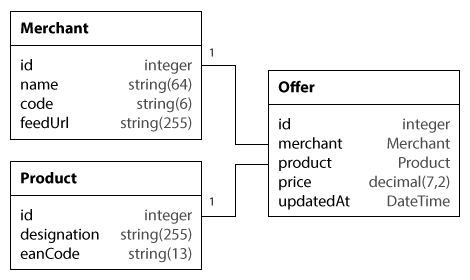

ekyna-learn/sf-comparator
=============

Créer un comparateur de prix avec Symfony. 

> Récupérer des flux de données de sites marchands,
> créer ou mettre à jour des offres de produits et
> afficher ces offres sur la partie publique. 

## Installation

Cloner le dépôt et installer les dépendances.

    > git clone https://github.com/ekyna-learn/sf-comparator.git
    > cd sf-comparator
    > composer install

## Model des données

## TODO

1. Créer un service nommé __app.feed.reader__ configuré avec la classe _AppBundle\Feed\Reader_, 
et lui injecter le service _Doctrine Entity Manager_ (__@doctrine.orm.entity_manager__) 
comme premier argument du constructeur. 
 
2. Développer la méthode __AppBundle\Feed\Reader::read()__.

        // Lire le content d'un fichier distant
        $content = file_get_contents($url);
        
        // Example de flux au format JSON :
        //   [
        //     {"price":323.57, "ean_code":"7895245668012"},
        //     {"price":372.7, "ean_code":"7051026984675"}
        //   ]
        
        // Transformer du JSON en tableau PHP
        $array = json_decode($json, true); // true pour obtenir des tableaux associatifs

3. Développer la méthode __AppBundle\Command\FeedCommand::execute()__. 

        // Accéder à un service du conteneur à partir d'une commande
        $this->getContainer()->get('app.example.service');

4. Utiliser la commande ainsi développée pour récupérer des offres. 

    > Les codes des marchands sont disponibles dans la méthode 
    __AppBundle\Model\Merchants::getData()__.

5. Sur la page d'accueil du site, afficher la liste des produits sous forme de liens vers la page détail produit.

6. Créer et développer la page détail produit _/product/[product-id]_, et afficher les offres disponibles. 

    > _marchand_, _prix_ et _date de mise à jour_.

7. Ajouter le support des formats CSV et XML au Feed Reader.

    > Modifier quelques urls de flux des marchands dans la base de données en remplaçant l'extension '__json__' par '__csv__' ou '__xml__'.

        // Récupérer l'extension d'un nom de fichier (ou d'une url avec extension).
        $format = pathinfo($path, PATHINFO_EXTENSION);
    
    
        // Example de flux au format CSV :
        7051026984675;323.82
        8413765946812;268.26

        // Lire un ficher CSV (local ou distant)
        $handle = fopen($pathOrUrl, 'r');
        while (false !== $data = fgetcsv($handle, null, ';')) {
            // $data = [<eandCode>, <price>];
        }
        fclose($handle);

        // Example de flux XML :
        <?xml version="1.0" encoding="utf-8"?>
        <offers>
          <offer ean_code="8043715098064" price="399.68"/>
          <offer ean_code="7940385061824" price="333.05"/>
        </offers>

        // Lire un fichier XML (local ou distant)
        $dom = new \DOMDocument();
        $dom->load($pathOrUrl);

        $offers = $dom->getElementsByTagName('offer');

        /** @var \DomElement $offer */
        foreach ($offers as $offer) {
            // public function \DomElement::getAttribute(string $name);
        }

8. Valider les offres avant de les enregistrer.
    
    * Configurer la validation des offres.
    * Injecter le service de validation (__@validator__) dans le service _Feed Reader_.

9. Envoyer un rapport à l'administrateur par email.  

    * [Lire un peu de doc.](http://symfony.com/doc/current/email.html)
    * Configurer l'envoi d'emails.
    * Injecter le service mailer (__@mailer__) dans le service _Feed Reader_.
    * Notifier l'administrateur du nombre d'offres crées/mises à jour.
